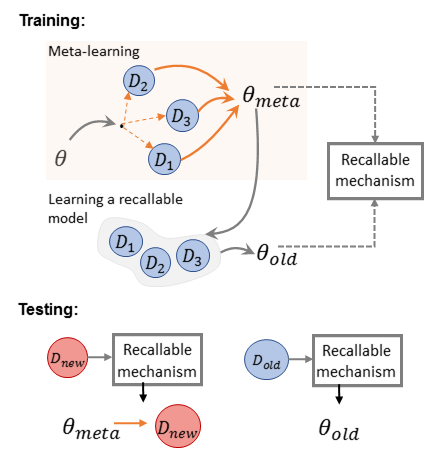

## Model-Agnostic Meta-Learning (MAML) for Dialogue State Tracking

This repo implements the model-agnostic meta-learning (MAML) for dialogue state tracking (DST). It achieves better performance than [TRADE](https://github.com/jasonwu0731/trade-dst) in the few-shot setting. It also implements the multi-task learning (MTL-DST) as the baseline. This code has been written using PyTorch >= 1.0. This work is in progress, which is preliminarily named recallable meta-learning for DST (RM-DST). If you are interested in the work, you can contact me for the draft.

<p align="center">

</p>

Download the MultiWOZ dataset and the processed dst version.
```console
❱❱❱ python3 create_data.py
```

## Dependency
Check the packages needed or simply run the command
```console
❱❱❱ pip install -r requirements.txt
```
If you run into an error related to Cython, try to upgrade it first.
```console
❱❱❱ pip install --upgrade cython
```

## Unseen Domain DST

#### MAML-DST
Training
```console
❱❱❱ python3 myTrain_maml_DND.py -dec=TRADE -bsz=32 -dr=0.2 -lr=0.001 -le=1 -exceptd=${domain}
```

#### MTL-DST
Training
```console
❱❱❱ python3 myTrain_MTL.py -dec=TRADE -bsz=32 -dr=0.2 -lr=0.001 -le=1 -exceptd=${domain} -add_name=MTL
```
* -exceptd: except domain selection, choose one from {hotel, train, attraction, restaurant, taxi}.

#### Fine-tune

MAML-DST
```console
❱❱❱ python3 fine_tune_dnd.py -bsz=8 -dr=0.2 -lr=0.001 -path=${save_path_except_domain} -exceptd=${except_domain}
```
MTL-DST
```console
❱❱❱ python3 fine_tune.py -bsz=8 -dr=0.2 -lr=0.001 -path=${save_path_except_domain} -exceptd=${except_domain}
```

## Results
<p align="center">

</p>

## Reference
1. [DAML](https://github.com/qbetterk/DAML): Domain Adaptive Dialog Generation via Meta Learning. [ACL 2019]
2. [TRADE](https://github.com/jasonwu0731/trade-dst): Transferable Multi-Domain State Generator for Task-Oriented Dialogue Systems. [ACL 2019]
3. Meta-Reinforced Multi-Domain State Generator for Dialogue Systems. [ACL 2020]
